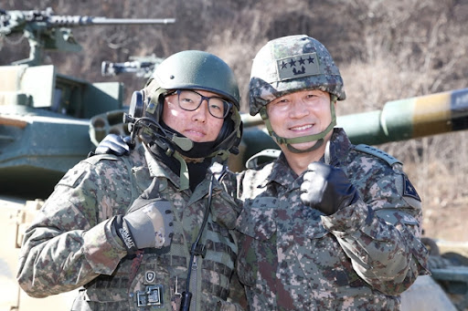

# mojiri ai(backend) readme.md

Date: 2021년 10월 6일
Status: on-going

# MOJIRI AI GUIDE

해당 프로젝트에서 AI의 역할은 **보안 위반사항 검출**을 위한 

**이미지 검사 및 처리**를 담당하고 있다.

**처리 과정**은 아래와 같다.

1. 이미지를 서버로부터 전달 받는다.
2. 먼저 해당 사진에 보안 위반 사항 글이 있는지 검출한다.
3. 이후, 사진 통과 항목들을 정한 후 통과 항목 제외 모두 블러처리를 진행한다.
4. 처리된 결과 이미지를 서버에 임시파일로 저장한다.
5. 서버에서 사용 한 다음 임시파일을 제거한다.

현재 프로젝트에서 빠른 개발과 효율성을 위해 오픈소스들을 적극적으로 사용하였다. 사용된 오픈소스들은 기재하였다.

## 필요 요소

- Python 3.x
- pip3
- python3-opencv

## 구성 및 사용법

### 구성

현재 AI 부문 구성은 이렇다.

- *requirements.txt*
    - 실행에 필요한 패키지들의 버전이 기록되어 있음
- *inhibit_list.scv*
    - 문서 금지 단어들 리스트 
- *setup.sh*
    - 간편한 설치를 위해 위 항목을 사용하여 패키지 설치 및 환경 세팅
- *run.sh*
    - 간편한 실행을 위한 실행 파일
- *run.py*
    - 실행 코드

### 사용법 (+테스트)
1. setup.sh 실행권한 부여 및 \r 을 삭제한다.
```bash
chmod 755 setup.sh
sed -i 's/\r$//' setup.sh
```
2. *setup.sh*를 통해 작업환경을 세팅한다.
```bash
# setup.sh
./setup.sh
```
3. *run.sh*를 통해 실행한다.

```bash
./run.sh [IMAGE_PATH] 

# for test, run this.
# ./run.sh images/image5.jpg
```

## 실행 결과
### Input Image

### Output Image


## Used Open Sources

- **OCR** *by PaddleOCR*
    - [https://github.com/PaddlePaddle/PaddleOCR](https://github.com/PaddlePaddle/PaddleOCR)
- **Image Segmentation** *by Google Deeplab V3+*
    - [https://github.com/bonlime/keras-deeplab-v3-plus](https://github.com/bonlime/keras-deeplab-v3-plus)
- **Image Blurring** *by patrickn699 (Google Deeplab V3+)*
    - [https://github.com/patrickn699/Background_Blur](https://github.com/patrickn699/Background_Blur)
