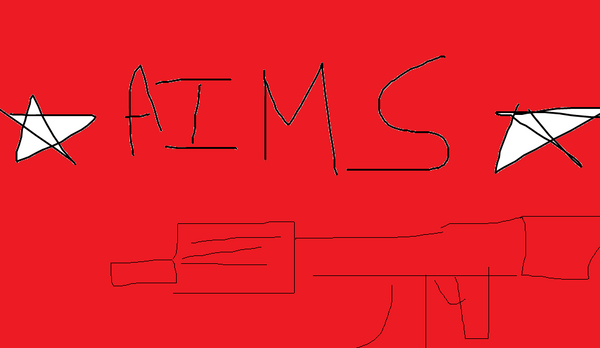
<p align="center">
	
	
	
	
	<br>
	<a href="https://sun-bottle-cdc.notion.site/5feecf30d55c43cfaf3d9faa0cfb788b">
</p>

<h2 align="center">프로젝트 설명</h2>
<table align="center">
	<tr>
		<td>
			<a href="https://youtu.be/CvEaEu7mY2s">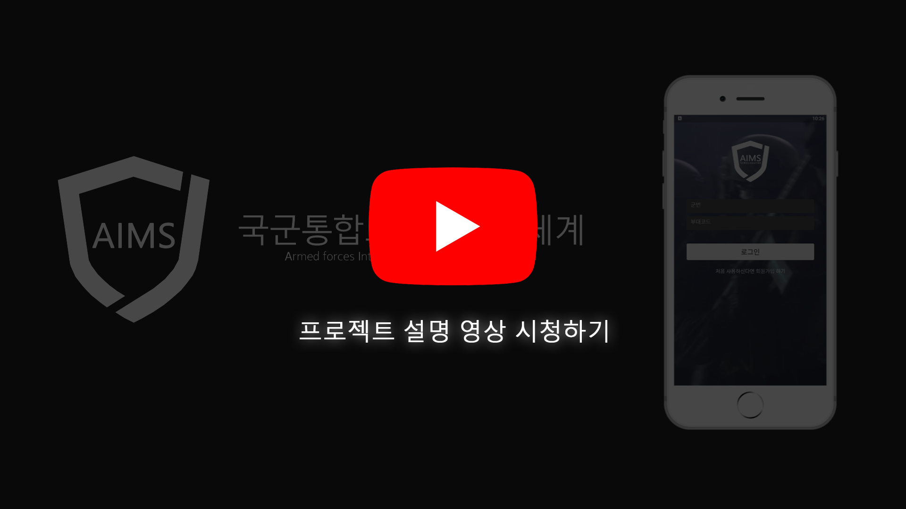</a>
		</td>
		<td>
			<a href="https://siwon.gitbook.io/aims">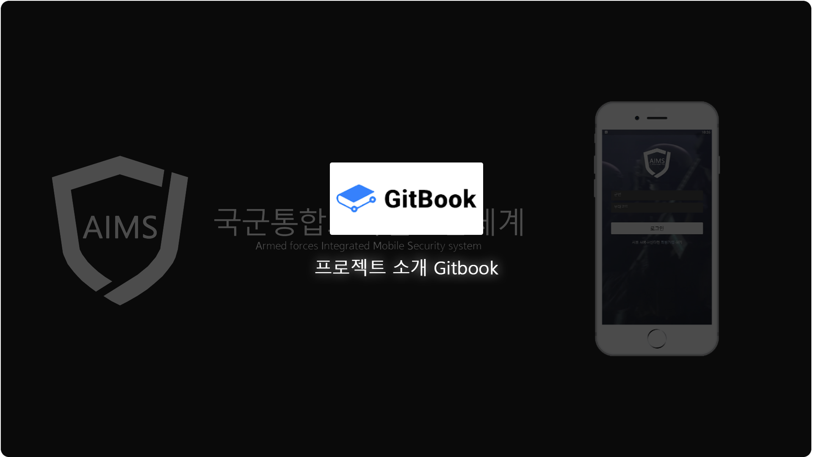</a>
		</td>
	</tr>
</table>


<br>
<br>
<br>

## 팀 소개
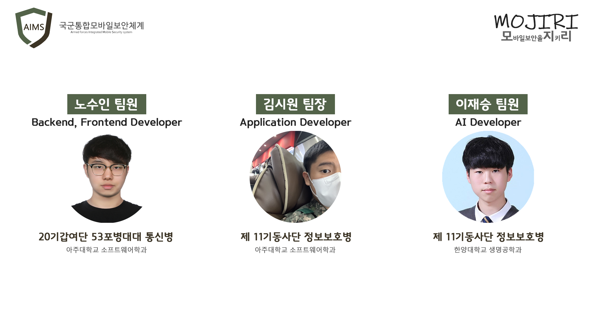

## 프로젝트 소개
<b>국군통합모바일보안체계</b>(Armed Forces Integrated Mobile Security System, 이하 AIMS)는 개인 상용 정보통신장비 사용간에 병사들의 권리를 보장하고 편리함을 증대시킴과 동시에 모든 군 구성원들로부터 발생하는 보안사고를 막기 위한 목적으로 개발되었습니다.<br><br>AIMS는 상용 정보통신장비 반입 간 필요한 절차들을 더욱 손쉽게 개선하였습니다. 또한, 카메라 기능을 조건부 허용하여 병사들의 권리는 더욱 보장하고 간부들이 행하는 보안사고는 줄일 수 있도록 하였습니다. 그리고 관리자를 위한 통합관리시스템을 구축하여 보안요소를 위배하는 사용자를 파악하여 내부침해시도를 막을 수 있도록 하였습니다.<br><br>이를 통해 우리 국군의 기밀성과 병사들의 자유를 동시에 수호하도록 노력했습니다.
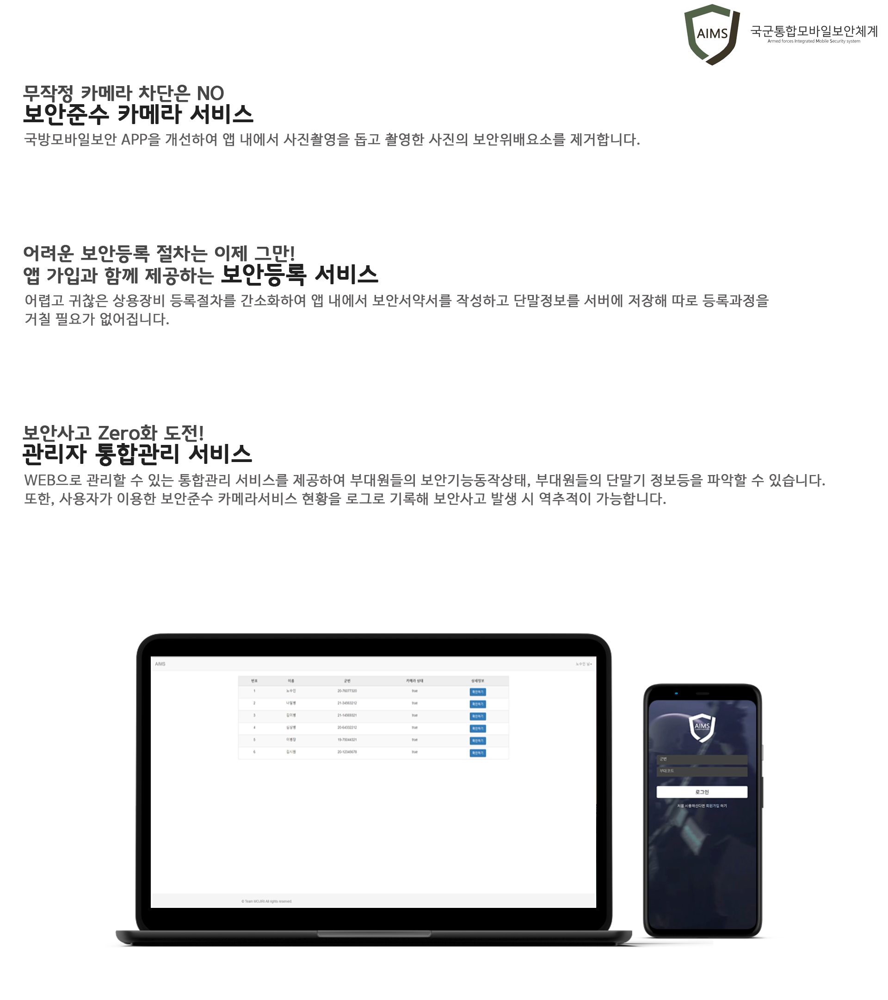


## 기능 설명
<table>
  <tbody>
		<tr>
			<td colspan=2>
				<br>
				<b>Permission Page</b><br>
				<br>
			</td>
		</tr>
		<tr>
      <td rowspan="2">
        <div align="center">
          
        </div>
      </td>
      <td width="65%">앱 최초실행 시 권한을 검사하고 권한을 허용해야합니다.<br>MDM App 특성상 많은 권한을 필요로합니다.</td>
    </tr>
  </tbody>
</table>
<br>
<br>
<table>
  <tbody>
		<tr>
			<td colspan=3>
				<br>
				<b>Login Page</b><br>
				<br>
			</td>
		</tr>
		<tr>
      <td rowspan="3">
        <div align="center">
          
        </div>
      </td>
			<td><div align="center">
		
        </div>
			</td>
      <td>권한 허용 시 등장하는 페이지입니다.<br>로그인과 회원가입을 제공합니다.</td>
    </tr>
  </tbody>
	
<br><br>
	<table>
  <tbody>
		<tr>
			<td colspan=2>
				<br>
				<b>SignUp Page</b><br>
				<br>
			</td>
		</tr>
		<tr>
      <td rowspan="2">
        <div align="center">
          
        </div>
      </td>
      <td width="70%">군번과 부대코드(임의 정의)를 통해 가입을 할 수 있습니다.<br>국방부의 인사정보DB와 연계하여 입력 시 신원을 확인할 수 있습니다.</td>
    </tr>
  </tbody>
</table>
<br>
<br>
	
<table>
  <tbody>
		<tr>
			<td colspan=2>
				<br>
				<b>Security Pledge Page</b><br>
				<br>
			</td>
		</tr>
		<tr>
      <td rowspan="2">
        <div align="center">
          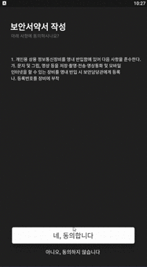
        </div>
      </td>
      <td width="70%">회원가입과 함께 보안서약서를 작성할 수 있습니다.<br>보안등록 절차를 간소화할 수 있습니다.</td>
    </tr>
  </tbody>
</table>
<br>
<br>
	
<table>
  <tbody>
		<tr>
			<td colspan=2>
				<br>
				<b>Disable Camera</b><br>
				<br>
			</td>
		</tr>
		<tr>
      <td rowspan="2">
        <div align="center">
          
        </div>
      </td>
      <td width="70%">앱 실행 시 카메라가 차단된 것을 확인할 수 있습니다.</td>
    </tr>
  </tbody>
</table>
<br>
<br>
<table>
  <tbody>
		<tr>
			<td colspan=3>
				<br>
				<b>Take Camera</b><br>
				<br>
			</td>
		</tr>
		<tr>
      <td rowspan="3">
        <div align="center">
          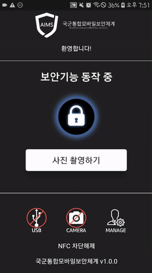
        </div>
      </td>
			<td><div align="center">
		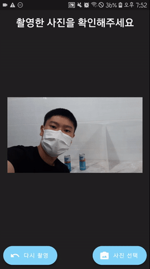
        </div>
			</td>
      <td>앱 내부에서 카메라를 작동시킬 수 있습니다.<br>이는 보안준수 카메라로 보안위배내역을 자동 블러처리해줍니다.<br>앱 내 캡쳐방지, 앱 강제종료시 다시 카메라 차단기능을 구현하여 혹시모를 사고를 방지했습니다.</td>
    </tr>
  </tbody>
	</table>
	
<br><br>
## 기대효과
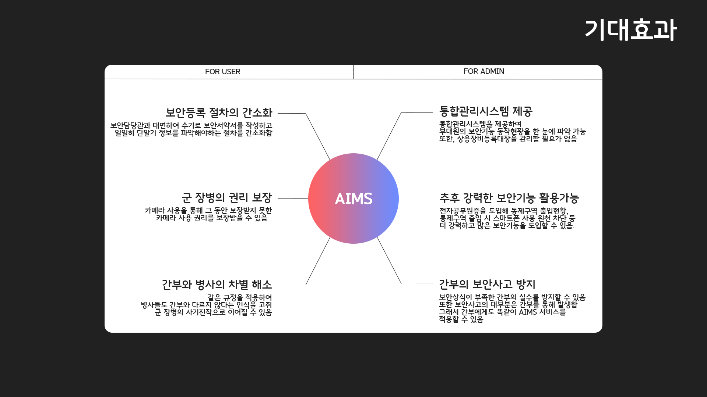

## 향후 발전방향
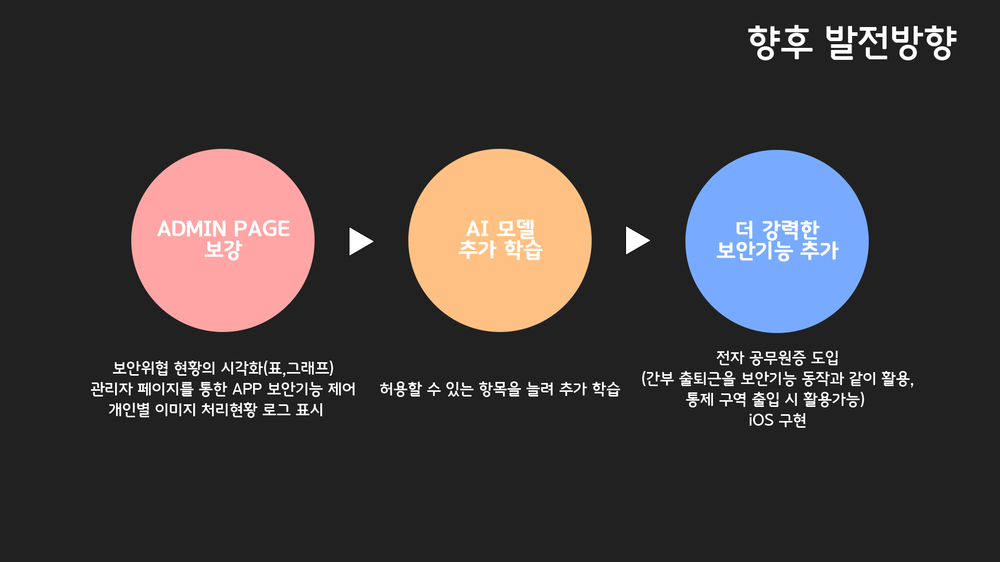

## 왜 AIMS여야 하는가
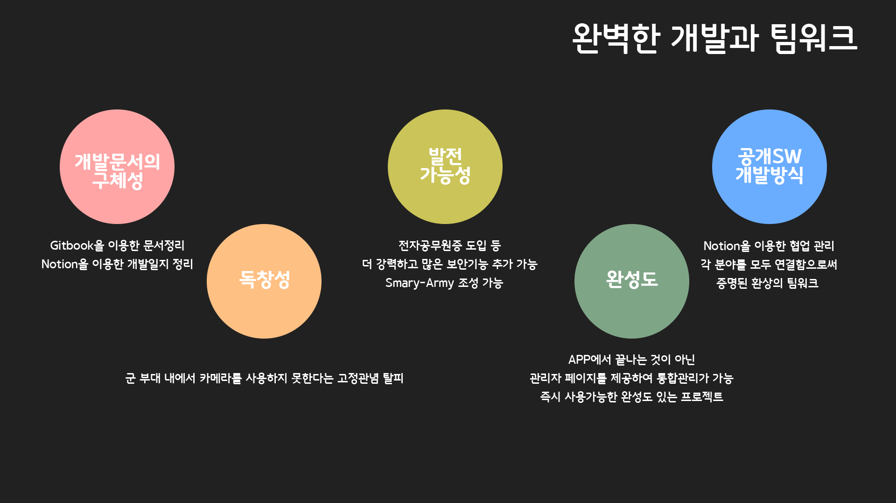

## 컴퓨터 구성 / 필수 조건 안내 (Prerequisites)
### WEB
ECMAScript 6 지원 브라우저 사용<br>
권장: Google Chrome 버젼 77 이상<br>
### APP
Android : minSdkVersion 21 (Android 5.0)
### AI
apt install needed
- Python 3.x version
- pip
- python3-opencv

## 기술 스택 (Technique Used) 
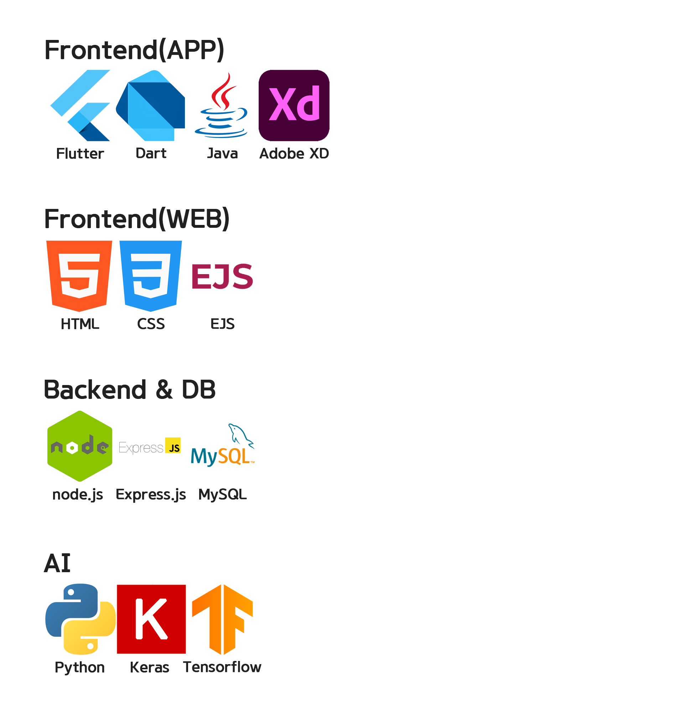
<details>
    <summary><strong>WEB 오픈소스 목록</strong> </summary>
	cookie-parser 1.4.4<br>
	cors 2.8.5<br>
	debug 2.6.9<br>
	ejs 3.1.6<br>
	express 4.16.1<br>
	http-errors 1.6.3<br>
	morgan 1.9.1<br>
	mysql 2.18.1<br>
	mysql2 2.3.0<br>
	path 0.12.7<br>
	request 2.88.2<br>
	sequelize 6.6.5<br>
	sequelize-cli 6.2.0<br>
</details>
<details>
    <summary><strong>APP 오픈소스 목록</strong> </summary>
	get: ^4.3.8<br>
	permission_handler: ^8.1.6<br>
	adobe_xd: ^2.0.0+1<br>
	fluttertoast: ^8.0.8<br>
	hand_signature: ^2.1.0+2<br>
	zoom_widget: ^0.2.1<br>
	http: ^0.13.4<br>
	device_information: ^0.0.4<br>
	camera: ^0.9.4+1<br>
	video_player: ^2.2.5<br>
	image_gallery_saver: ^1.7.1
</details>
<details>
    <summary><strong>AI 오픈소스 목록</strong> </summary>
	- paddleocr 2.3.0.1<br>
	- model : google deeplab v3+
</details>

## 설치 안내 (Installation Process)
### APP
1. Github Clone하기
```bash
$ git clone http://github.com/osamhack2021/APP_WEB_AI_AIMS_MOJIRI
```
2. 프로젝트 빌드하기
```bash
$ cd 'APP(Android)'/aims
$ Flutter build apk
```
3. APK 설치하기
```bash
$ cd 'APP(Android)'/aims/build/app/outputs/flutter-apk
$ app_release.apk 다운로드 후 설치
```

### WEB & Backend
1. Github Clone하기
```bash
$ git clone http://github.com/osamhack2021/APP_WEB_AI_AIMS_MOJIRI
```

2. Backend Module 설치하기
```
$ cd APP_WEB_AI_AIMS_MOJIRI

AI (about more info, read AI/readme.md)
$ cd /AI
$ chmod 755 setup.sh
$ sed -i 's/\r$//' setup.sh
$ ./setup.sh

WEB
$ cd ../WEB
$ npm install
```

3. Server 실행하기
```
$ sudo npm start
```

4. Test DB Data 
```
$ cd APP_WEB_AI_AIMS_MOJIRI/WEB\(BE\)
$ npx sequelize-cli db:seed:all;
```
 
## 팀 정보 (Team Information)
<table width="700">
<thead>
<tr>
<th width="120" align="center">사진</th>
<th width="100" align="center">이름</th>
<th width="200" align="center">담당</th>
<th width="150" align="center">Github</th>
<th width="175" align="center">Contact</th>
</tr> 
</thead>
<tbody>
<tr>
<td width="120" align="center"></td>
<td width="100" align="center">김시원</td>
<td width="200">팀장<br>APP개발</td>
<td width="150" align="center">
	<a href="https://github.com/kimww42">
		
	</a>
</td>
<td width="175" align="center">
	<a href="mailto:kimsiw42@ajou.ac.kr"></a>
	</td>
</tr>
<tr>
<td width="120" align="center"></td>
<td width="100" align="center">노수인</td>
<td width="200">백엔드 개발<br>관리자Web개발</td>

<td width="150" align="center">
	<a href="https://github.com/bigpie1367">
		
	</a>
</td>
<td width="175" align="center">
	<a href="mailto:bigpie1367@gmail.com"></a>
	</td>
</tr>
<tr>
<td width="120" align="center"></td>
<td width="100" align="center">이재승</td>
<td width="200">팀 협업 관리<br>ML 개발총괄</td>

<td width="150" align="center">
	<a href="https://github.com/js0807">
		
	</a>
</td>
<td width="175" align="center">
	<a href="mailto:nemojs87@gmail.com"></a>
	</td>
</tr>
</tr>
</tbody>
</table>

## 저작권 및 사용권 정보 (Copyleft / End User License)
 * [MIT](LICENSE.md)

This project is licensed under the terms of the MIT license.
